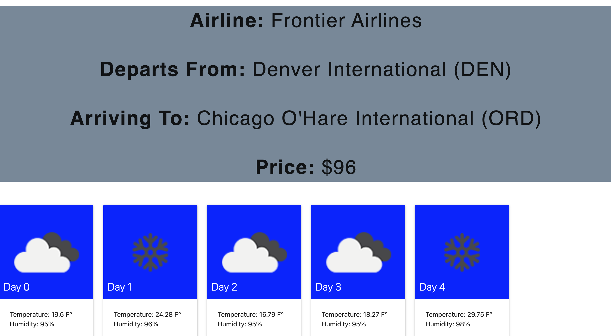

# Project1
 

## Description
The World’s Best Trip Planner is meant for a user who wants to find the cheapest flight available for a particular destination, and the weather of the first 5 days when they get there. Unlike other flight-finding applications (such as Travelocity, Hotels.com, KAYAK, etc.), this is a simplified, ad-free experience. This application does not use a user’s browser history to gauge the prices. The user also needs our application if they want to be prepared for the weather when they arrive to their destination.
When the user inputs their destination Then SkyScanner, a third-party API, scans hundreds of resources to find the cheapest flight available for the selected dates. When the results for the cheapest flight become viable Then the user is also shown the weather forecast for the first 5 days of their trip starting on the day their flight arrives in their destination city(day 0).

## Technologies used
We used a mix of html, css, materialize, and javascript for the apperance. Some portions of the application where web api fetches were used to collect data, such as the forecast, are displayed in html dynamically using Javascript. With the dynamic creation and display of the content we needed, if updates were necessary, we could apply them all in one spot instead of having to edit html, css, and Javascript separately.

## Deployed application
https://iigonzoii.github.io/Project1/
